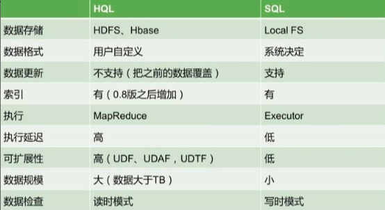

# Hive Key Points

Hive is a Hadoop-based data warehouse tool that maps structured data files into a database table and provides complete SQL query functionality that converts SQL statements into MapReduce tasks for execution. It is very suitable for statistical analysis of data warehouse.
<!--more-->

## Hive的两张表关联，使用MapReduce怎么实现？

如果其中有一张表为小表，直接使用map端join的方式（map端加载小表）进行聚合。

如果两张都是大表，那么采用联合key，联合key的第一个组成部分是joinon中的公共字段，第二部分是一个flag，0代表表A，1代表表B，由此让Reduce区分客户信息和订单信息；在Mapper中同时处理两张表的信息，将joinon公共字段相同的数据划分到同一个分区中，进而传递到一个Reduce中，然后在Reduce中实现聚合。

## Hive的特点，Hive和RDBMS有什么异同？

  hive是基于Hadoop的一个数据仓库工具，可以将结构化的数据文件映射为一张数据库表，并提供完整的sql查询功能，可以将sql语句转换为MapReduce任务进行运行。其优点是学习成本低，可以通过类SQL语句快速实现简单的MapReduce统计，不必开发专门的MapReduce应用，十分适合数据仓库的统计分析，但是Hive不支持实时查询。

Hive与关系型数据库的区别：

## hive中SortBy，OrderBy，ClusterBy，DistrbuteBy各代表什么意思？

Orderby：会对输入做全局排序，因此只有一个reducer（多个reducer无法保证全局有序）。只有一个reducer，会导致当输入规模较大时，需要较长的计算时间。

Sortby：不是全局排序，其在数据进入reducer前完成排序。

Distributeby：按照指定的字段对数据进行划分输出到不同的reduce中。

Clusterby：除了具有distributeby的功能外还兼具sortby的功能。

## Hive中split、coalesce及collect_list函数的用法（举例）？

split将字符串转化为数组，即：split('a,b,c,d',',')==>["a","b","c","d"]。

coalesce(Tv1,Tv2,…)返回参数中的第一个非空值；如果所有值都为NULL，那么返回NULL。

collect_list列出该字段所有的值，不去重=>selectcollect_list(id)fromtable。

## Hive有哪些方式保存元数据，各有哪些特点？

Hive支持三种不同的元存储服务器，分别为：内嵌式元存储服务器、本地元存储服务器、远程元存储服务器，每种存储方式使用不同的配置参数。

内嵌式元存储主要用于单元测试，在该模式下每次只有一个进程可以连接到元存储，Derby是内嵌式元存储的默认数据库。

在本地模式下，每个Hive客户端都会打开到数据存储的连接并在该连接上请求SQL查询。

在远程模式下，所有的Hive客户端都将打开一个到元数据服务器的连接，该服务器依次查询元数据，元数据服务器和客户端之间使用Thrift协议通信。

## Hive内部表和外部表的区别？

创建表时：创建内部表时，会将数据移动到数据仓库指向的路径；若创建外部表，仅记录数据所在的路径，不对数据的位置做任何改变。

删除表时：在删除表的时候，内部表的元数据和数据会被一起删除，而外部表只删除元数据，不删除数据。这样外部表相对来说更加安全些，数据组织也更加灵活，方便共享源数据。

## Hive的函数：UDF、UDAF、UDTF的区别？

UDF：单行进入，单行输出

UDAF：多行进入，单行输出

UDTF：单行输入，多行输出

## 所有的Hive任务都会有MapReduce的执行吗？

不是，从Hive0.10.0版本开始，对于简单的不需要聚合的类似SELECTfrom

LIMITn语句，不需要起MapReducejob，直接通过Fetchtask获取数据。

## Hive桶表的理解？

桶表是对数据`某个字段`进行哈希取值，然后放到不同文件中存储。

数据加载到桶表时，会对字段取hash值，然后与桶的数量取模。把数据放到对应的文件中。物理上，每个桶就是表(或分区）目录里的一个文件，一个作业产生的桶(输出文件)和reduce任务个数相同。

桶表专门用于抽样查询，是很专业性的，不是日常用来存储数据的表，需要抽样查询时，才创建和使用桶表。

## Hive底层与数据库交互原理？

Hive的查询功能是由HDFS和MapReduce结合起来实现的，对于大规模数据查询还是不建议在hive中，因为过大数据量会造成查询十分缓慢。Hive与MySQL的关系：只是借用MySQL来存储hive中的表的元数据信息，称为metastore（元数据信息）。

## Hive本地模式

大多数的HadoopJob是需要Hadoop提供的完整的可扩展性来处理大数据集的。不过，有时Hive的输入数据量是非常小的。在这种情况下，为查询触发执行任务时消耗可能会比实际job的执行时间要多的多。对于大多数这种情况，Hive可以通过本地模式在单台机器上处理所有的任务。对于小数据集，执行时间可以明显被缩短。

用户可以通过设置hive.exec.mode.local.auto的值为true，来让Hive在适当的时候自动启动这个优化。

## Hive中的压缩格式TextFile、SequenceFile、RCfile、ORCfile各有什么区别？

**1、TextFile**

默认格式，**存储方式为行存储，数据不做压缩，磁盘开销大，数据解析开销大**。可结合Gzip、Bzip2使用(系统自动检查，执行查询时自动解压)，但使用这种方式，压缩后的文件不支持split，Hive不会对数据进行切分，从而无法对数据进行并行操作。并且在反序列化过程中，必须逐个字符判断是不是分隔符和行结束符，因此反序列化开销会比SequenceFile高几十倍。

**2、SequenceFile**

SequenceFile是HadoopAPI提供的一种二进制文件支持，**存储方式为行存储，其具有使用方便、可分割、可压缩的特点**。

SequenceFile支持三种压缩选择：`NONE`，`RECORD`，`BLOCK`。Record压缩率低，**一般建议使用BLOCK压缩**。

优势是文件和hadoopapi中的MapFile是相互兼容的

**3、RCFile**

存储方式：**数据按行分块，每块按列存储**。结合了行存储和列存储的优点：

首先，RCFile保证同一行的数据位于同一节点，因此元组重构的开销很低；

其次，像列存储一样，RCFile能够利用列维度的数据压缩，并且能跳过不必要的列读取；

**4、ORCFile**

存储方式：数据按行分块每块按照列存储。

压缩快、快速列存取。

效率比rcfile高，是rcfile的改良版本。

小结：

**相比TEXTFILE和SEQUENCEFILE，RCFILE由于列式存储方式，数据加载时性能消耗较大，但是具有较好的压缩比和查询响应**。

**数据仓库的特点是一次写入、多次读取，因此，整体来看，RCFILE相比其余两种格式具有较明显的优势**。

## Hive表关联查询，如何解决数据倾斜的问题？

1）倾斜原因：map输出数据按keyHash的分配到reduce中，由于key分布不均匀、业务数据本身的特、建表时考虑不周、等原因造成的reduce上的数据量差异过大。
 （1）key分布不均匀;
 （2）业务数据本身的特性;
 （3）建表时考虑不周;
 （4）某些SQL语句本身就有数据倾斜;
 如何避免：对于key为空产生的数据倾斜，可以对其赋予一个随机值。
 2）解决方案
 （1）参数调节：
  hive.map.aggr=true
  hive.groupby.skewindata=true
 有数据倾斜的时候进行负载均衡，当选项设定位true,生成的查询计划会有两个MRJob。第一个MRJob中，Map的输出结果集合会随机分布到Reduce中，每个Reduce做部分聚合操作，并输出结果，这样处理的结果是相同的GroupByKey有可能被分发到不同的Reduce中，从而达到负载均衡的目的；第二个MRJob再根据预处理的数据结果按照GroupByKey分布到Reduce中（这个过程可以保证相同的GroupByKey被分布到同一个Reduce中），最后完成最终的聚合操作。
 （2）SQL语句调节：
 ①选用joinkey分布最均匀的表作为驱动表。做好列裁剪和filter操作，以达到两表做join的时候，数据量相对变小的效果。
 ②大小表Join：
  使用mapjoin让小的维度表（1000条以下的记录条数）先进内存。在map端完成reduce。
 ③大表Join大表：
  把空值的key变成一个字符串加上随机数，把倾斜的数据分到不同的reduce上，由于null值关联不上，处理后并不影响最终结果。
 ④countdistinct大量相同特殊值:
  countdistinct时，将值为空的情况单独处理，如果是计算countdistinct，可以不用处理，直接过滤，在最后结果中加1。如果还有其他计算，需要进行groupby，可以先将值为空的记录单独处理，再和其他计算结果进行union。

## Fetch抓取

Fetch抓取是指，Hive中对某些情况的查询可以不必使用MapReduce计算。例如：SELECT*FROMemployees;在这种情况下，Hive可以简单地读取employee对应的存储目录下的文件，然后输出查询结果到控制台。

在hive-default.xml.template文件中hive.fetch.task.conversion默认是more，老版本hive默认是minimal，该属性修改为more以后，在全局查找、字段查找、limit查找等都不走mapreduce。

## 小表、大表Join

将key相对分散，并且数据量小的表放在join的左边，这样可以有效减少内存溢出错误发生的几率；再进一步，可以使用Group让小的维度表（1000条以下的记录条数）先进内存。在map端完成reduce。

实际测试发现：新版的hive已经对小表JOIN大表和大表JOIN小表进行了优化。小表放在左边和右边已经没有明显区别。

## 大表Join大表

1）空KEY过滤 有时join超时是因为某些key对应的数据太多，而相同key对应的数据都会发送到相同的reducer上，从而导致内存不够。此时我们应该仔细分析这些异常的key，很多情况下，这些key对应的数据是异常数据，我们需要在SQL语句中进行过滤。例如key对应的字段为空。2）空key转换 有时虽然某个key为空对应的数据很多，但是相应的数据不是异常数据，必须要包含在join的结果中，此时我们可以表a中key为空的字段赋一个随机的值，使得数据随机均匀地分不到不同的reducer上。

## GroupBy

默认情况下，Map阶段同一Key数据分发给一个reduce，当一个key数据过大时就倾斜了。并不是所有的聚合操作都需要在Reduce端完成，很多聚合操作都可以先在Map端进行部分聚合，最后在Reduce端得出最终结果。

1）开启Map端聚合参数设置  （1）是否在Map端进行聚合，默认为True   hive.map.aggr=true  （2）在Map端进行聚合操作的条目数目   hive.groupby.mapaggr.checkinterval=100000  （3）有数据倾斜的时候进行负载均衡（默认是false）   hive.groupby.skewindata=true**当选项设定为true，生成的查询计划会有两个MRJob**。第一个MRJob中，Map的输出结果会随机分布到Reduce中，每个Reduce做部分聚合操作，并输出结果，这样处理的结果是**相同的GroupByKey有可能被分发到不同的Reduce中**，从而达到负载均衡的目的；第二个MRJob再根据预处理的数据结果按照GroupByKey分布到Reduce中（这个过程可以保证相同的GroupByKey被分布到同一个Reduce中），最后完成最终的聚合操作。

## Count(Distinct)去重统计

数据量小的时候无所谓，数据量大的情况下，由于COUNTDISTINCT操作需要用一个ReduceTask来完成，这一个Reduce需要处理的数据量太大，就会导致整个Job很难完成，一般COUNTDISTINCT使用先GROUPBY再COUNT的方式替换

## 笛卡尔积

尽量避免笛卡尔积，join的时候不加on条件，或者无效的on条件，Hive只能使用1个reducer来完成笛卡尔积

## 行列过滤

列处理：在SELECT中，只拿需要的列，如果有，尽量使用分区过滤，少用SELECT*。

行处理：在分区剪裁中，当使用外关联时，如果将副表的过滤条件写在Where后面，那么就会先全表关联，之后再过滤。

## 并行执行

Hive会将一个查询转化成一个或者多个阶段。这样的阶段可以是MapReduce阶段、抽样阶段、合并阶段、limit阶段。或者Hive执行过程中可能需要的其他阶段。默认情况下，Hive一次只会执行一个阶段。不过，某个特定的job可能包含众多的阶段，而这些阶段可能并非完全互相依赖的，也就是说有些阶段是可以并行执行的，这样可能使得整个job的执行时间缩短。不过，如果有更多的阶段可以并行执行，那么job可能就越快完成。

通过设置参数hive.exec.parallel值为true，就可以开启并发执行。不过，在共享集群中，需要注意下，如果job中并行阶段增多，那么集群利用率就会增加。

